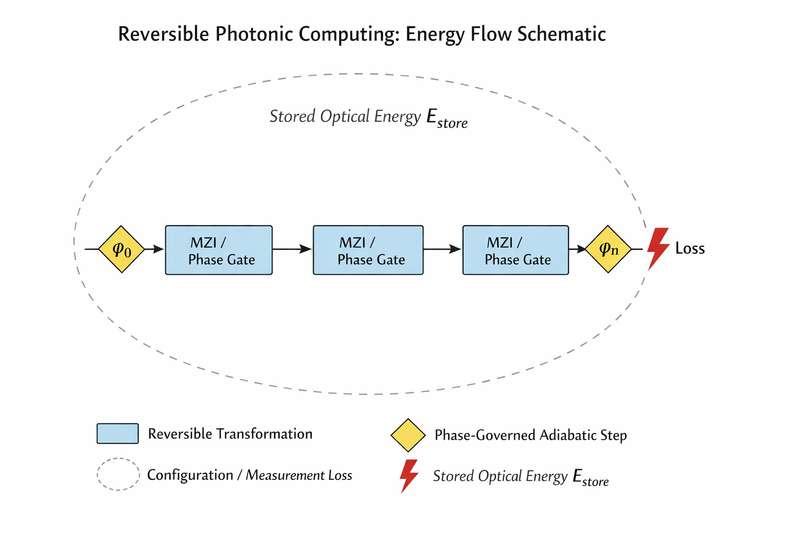

# Reversible Photonic Computing (RPC) Framework

**A formal, simulation-backed framework for bounded-dissipation, reversible optical computing.**

This repository captures the **technical appendix** for RPC as documented in the Zenodo record:

**Zenodo DOI:** [10.5281/zenodo.18442930](https://doi.org/10.5281/zenodo.18442930)

RPC separates **passive optical evolution** from **explicit configuration energy**, enabling reversible computation where dissipation occurs **only at configuration boundaries**.

---

## Core Principles

- **Pay for change, not time:** Hold states are nearly free (high-Q photonic resonators)  
- **Additive, bounded dissipation:** Hybrid electronic–photonic systems compose without hidden cross-terms  
- **Formal verification:** Lean 4 invariants and Python simulations validate energy bounds at chip-to-infrastructure scale  
- **Infrastructure framing:** RPC is a minimum closed reversible photonic core, intended as a substrate option, **not a product or SKU**

---

## Repository Structure

lean/ → Formal invariants & theorem proofs (Lean 4 + Mathlib)
sims/ → Python simulations for energy and scaling
docs/ → Scenario note, engineering assumptions, readme references
figures/ → SVG schematics and illustrative visuals


Key `/docs` files:

- `iam_scenario_note.md` → Infrastructure & IAM framing  
- `engineering_assumptions.md` → Numerical bounds tied to formal invariants

---

## How to Read the Schematic

Diagrams show **logical energy flow**, not physical layout:

- **Rectangles:** Reversible, bijective optical transformations  
- **Loop `E_store`:** Conserved optical energy  
- **Diamonds `φ0…φn`:** Phase-governed, adiabatic steps  
- **Energy loss:** Only at explicit configuration or measurement boundaries  



---

## Getting Started

Clone the repository:

```bash
git clone https://github.com/Art/reversible-photonic-computing.git
cd reversible-photonic-computing
Explore /lean for formal proofs, /sims for numerical simulations, and /docs for scenario context.

License
This work is licensed under CC BY 4.0. Users are free to share and adapt the material with attribution.

Citation
@misc{scott2025rpc,
  title = {Photon Reuse versus Reversible, Bounded-Dissipation Optical Computing},
  author = {Art Scott},
  year = {2025},
  doi = {10.5281/zenodo.18442930},
  url = {https://doi.org/10.5281/zenodo.18442930}
}
Acknowledgments
Built with insights from Reversible Comuting Tutor (RCT ChatGPT), Grok, AI neighborhood, and the reversible computing community. Mahalo nui loa.
